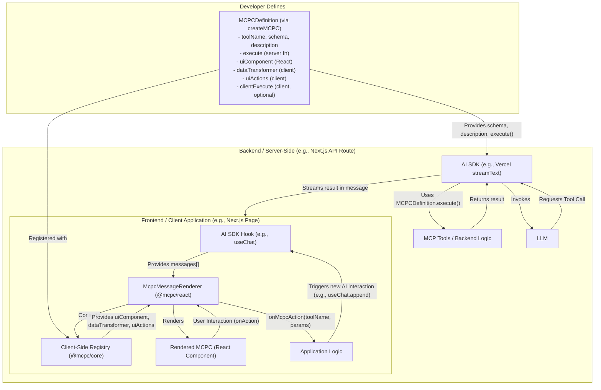

# mcpc - Model Context Protocol Components

## Vision

**mcpc** aims to revolutionize Human-AI interaction by providing a standardized way for AI models to render and interact with dynamic, rich UI components. Instead of AI responses being limited to text or raw JSON, `mcpc` enables AIs to present information and actions through a familiar, interactive user interface, seamlessly blending AI capabilities with human-centric design.

We envision an ecosystem where developers can easily create, share, and consume "AI-aware" UI components (MCPCs), making AI applications more intuitive, engaging, and powerful. `mcpc` is designed to work seamlessly with existing AI SDKs like the Vercel AI SDK, enhancing the presentation layer.

## Core Concepts

At its heart, `mcpc` defines a pattern for creating full-stack, AI-interactive UI components through **MCPC Definitions**.



This architecture allows for a clear separation of concerns while enabling rich, interactive AI experiences.

1.  **MCPC Definition (`@mcpc/core`)**: 
    *   The central artifact created using a factory function like `createMCPC({...})`.
    *   It bundles all aspects of an AI-interactive component:
        *   `toolName`: A unique identifier (e.g., `weather.getCurrentWeather`, `com.example/user.profile`).
        *   `description`: For the LLM to understand the tool's purpose.
        *   `schema`: Zod schema for the tool's input parameters (used by the LLM).
        *   `execute`: Server-side function to be executed when the LLM calls the tool.
        *   `uiComponent`: The React component used to render the tool's result or other data.
        *   `dataTransformer` (optional): Client-side function to transform raw tool execution results into props suitable for the `uiComponent`.
        *   `uiActions` (optional): Client-side mapping of named UI interactions (from the component's `onAction` prop) to new MCP tool calls or client-side logic.
        *   `clientExecute` (optional): Client-side functions that can be triggered by `uiActions` for purely frontend interactions without an LLM roundtrip.
    *   These definitions are designed to be isomorphic and can be imported in both server and client code.

2.  **Client-Side Registry (`@mcpc/core`)**: 
    *   A simple map where `MCPCDefinition` objects are registered on the client using `registerMcpcDefinition(YourMCPCDefinition)`.
    *   The `McpcMessageRenderer` uses this registry to find the appropriate UI rendering logic for a given tool name.

3.  **`McpcMessageRenderer` (`@mcpc/react`)**: 
    *   A React component that developers use to render messages from an AI SDK (like Vercel AI SDK's `useChat`).
    *   It inspects each message. If a message contains a tool call result (or is an assistant message intended to render a UI without a prior tool call, a future extension), it looks up the corresponding `MCPCDefinition` in the client-side registry.
    *   It then uses the `uiComponent`, `dataTransformer`, and `uiActions` from the definition to render the interactive UI.
    *   It provides an `onMcpcAction` callback for the application to handle actions initiated from within MCPCs (e.g., to trigger new messages or tool requests via the AI SDK).

4.  **AI SDK Integration**: 
    *   **Backend**: Developers import `MCPCDefinition`s and use their `toolName`, `description`, `schema`, and `execute` properties to construct the `tools` object passed to the AI SDK's core functions (e.g., `streamText`).
    *   **Frontend**: The AI SDK (e.g., `useChat`) manages the conversation state (`messages`). These messages are passed to the `McpcMessageRenderer`.
    *   `mcpc` enhances the presentation of these messages, particularly tool call results, without altering the AI SDK's core message flow or state management.

5.  **CLI (`npx mcpc ...`) (Future)**: 
    *   For discovering, adding, and managing `MCPCDefinition` packages from a community registry or local/git sources.
    *   Aims to simplify sharing and reuse of full-stack AI-interactive components.

## Project Requirements

(This section remains largely the same but will be reviewed for consistency with the new architecture)

### Functional Requirements

1.  **Dynamic UI from AI:** AI tool call results, present in the AI SDK's message stream, must be renderable as specific UI components.
2.  **Component-Driven Display:** `MCPCDefinition`s map tool names to React components for rendering.
3.  **Interactive Components:** MCPCs use an `onAction` prop to signal user interactions, which are handled via the `McpcMessageRenderer`'s `onMcpcAction` callback.
4.  **Bidirectional Action Flow:** User interactions can trigger new AI interactions (via the app invoking AI SDK methods). AI initiates UI by returning tool calls/results.
5.  **AI Contextual Awareness:** The AI SDK remains responsible for managing conversation history, including tool calls and their results, ensuring AI context.
6.  **Data Transformation:** `MCPCDefinition.dataTransformer` handles client-side transformation of tool results for UI display.

### Developer Experience (DX) Requirements

7.  **Component Definition (`createMCPC`):** A clear, declarative API (`createMCPC`) to define all aspects of an MCPC (tool schema, server execution, UI component, client-side logic) in one place.
8.  **Registration:** Simple client-side registration of `MCPCDefinition`s (`registerMcpcDefinition`).
9.  **Ecosystem & Shareability (Future):** Design for easy sharing of `MCPCDefinition` packages.
10. **State Management Flexibility:** `mcpc` is unopinionated about app-level state (Zustand, Jotai, etc.). MCPCs are React components and can use hooks as needed.
11. **Simple Integration:** Use `McpcMessageRenderer` with existing AI SDK hooks. Server-side, construct the `tools` object for the AI SDK from `MCPCDefinition`s.

### Non-Functional / Architectural Requirements

12. **Modularity:** Separate packages for core logic (`@mcpc/core`), React integration (`@mcpc/react`), and potentially a UI kit (`@mcpc/ui`) and CLI (`@mcpc/cli`).
13. **Compatibility:** Designed to work with popular AI SDKs (primary example: Vercel AI SDK).
14. **Isomorphic Definitions:** `MCPCDefinition`s can be used in both client and server environments.

### Key Considerations & Open Questions

*   **Server-Side Rendering (SSR) of MCPCs:** How would initial MCPC states be handled with SSR?
*   **`clientExecute` vs. `uiActions`:** Refine the distinction and utility of purely client-side actions defined in an MCPC.
*   **Security:** Always paramount, especially with server-side `execute` functions and client-side rendering from AI data.
*   **Error Handling:** Robust error handling in the `McpcMessageRenderer` and during `execute` calls.
*   **Advanced `uiActions`:** Support for more complex action types (e.g., optimistic updates, state manipulation hints).

## High-Level Architecture

(The previous detailed diagram showing AI Agent -> MCP Tool Layer -> Component Layer can be adapted or kept to illustrate the server-side tool execution aspect. The new diagram at the start of Core Concepts covers the overall data flow.)

**Simplified Flow (Focus on `mcpc` integration with Vercel AI SDK):**

1.  **Define MCPCs**: Developer uses `createMCPC` to define `MyWeatherMCPC`, `MyStockMCPC`, etc., bundling schema, server `execute` logic, React `uiComponent`, `dataTransformer`, and `uiActions`.
2.  **Server Setup (`/api/chat`)**: 
    *   Import defined MCPCs.
    *   Construct a `tools` object for `streamText` (from Vercel AI SDK) using `toolName`, `description`, `schema`, and `execute` from each imported MCPCDefinition.
3.  **Client Setup (e.g., `app/mcpc-init.ts`)**: 
    *   Import defined MCPCs.
    *   Call `registerMcpcDefinition(MyWeatherMCPC)`, `registerMcpcDefinition(MyStockMCPC)` for each.
4.  **AI Interaction (`app/page.tsx`)**: 
    *   Use `useChat()` from Vercel AI SDK.
    *   Iterate through `messages` from `useChat()`.
    *   For each message, render `<McpcMessageRenderer message={message} onMcpcAction={handleAppAction} />`.
5.  **`McpcMessageRenderer` Logic**: 
    *   If `message.role === 'tool'` (or an assistant message with special UI hints), it uses `message.name` (tool name) to look up the `MCPCDefinition` in its client-side registry.
    *   It calls the `dataTransformer` with `message.content` (tool result).
    *   It renders the `uiComponent` with transformed data and an internal `onAction` handler.
6.  **User Interaction with Rendered MCPC**: User clicks a button in a rendered MCPC.
7.  **Action Handling**: The MCPC calls its `onAction('ACTION_NAME', {payload})` prop.
8.  **`McpcMessageRenderer` to App Logic**: The renderer consults the `MCPCDefinition.uiActions` for `'ACTION_NAME'`. 
    *   If the action maps to a new server tool call, `onMcpcAction` is called with `{ toolToCall: 'new.tool.name', params: mappedParams }`.
    *   If it maps to a `clientExecute` function, that function is called directly.
9.  **Application's `handleAppAction`**: Receives `{ toolToCall, params }`. Uses `useChat().append()` to send a new user message prompting the AI to call `new.tool.name` with `params`.
10. **AI Context & Loop**: The AI SDK ensures all tool calls and results are in the LLM's context. The conversation continues.

## Getting Started (Conceptual - `createMCPC` focused)

### 1. Define an MCPC (e.g., `weather-mcpc.ts`)

```typescript
// common/mcpc-definitions/weather-mcpc.ts
import { createMCPC, MCPCProps } from '@mcpc/core';
import { z } from 'zod';

export interface WeatherData { location: string; temperature: string; description: string; iconUrl?: string; }
export interface WeatherActionParams { location: string; days?: number; }

const WeatherDisplayComponent: React.FC<MCPCProps<WeatherData, WeatherActionParams>> = ({ data, onAction }) => {
  return (
    <div className="weather-card" style={{border: '1px solid #ccc', padding: '10px', margin: '5px'}}>
      <h4>{data.location}</h4>
      <p>Temperature: {data.temperature}</p>
      <p>Condition: {data.description} {data.iconUrl && }</p>
      <button onClick={() => onAction('GET_7_DAY_FORECAST', { location: data.location, days: 7 })}> 
        7-Day Forecast
      </button>
      <button onClick={() => onAction('REFRESH_CURRENT', { location: data.location })}>
        Refresh Current
      </button>
    </div>
  );
};

export const GetCurrentWeatherMCPC = createMCPC<z.ZodObject<{location: z.ZodString}>, 
  { city: string; temp_c: number; condition: string; icon: string }, 
  WeatherData, 
  WeatherActionParams 
>({
  toolName: 'weather.getCurrentWeather',
  description: 'Gets the current weather for a specified location.',
  schema: z.object({ location: z.string().describe("The city, e.g., San Francisco, CA") }),
  
  execute: async ({ location }) => {
    console.log(`SERVER: Fetching weather for ${location}`);
    await new Promise(res => setTimeout(res, 500)); 
    if (location.toLowerCase().includes("fail")) throw new Error ("Failed to fetch weather for this city");
    return {
      city: location,
      temp_c: Math.floor(Math.random() * 20) + 10, 
      condition: ['Sunny', 'Cloudy', 'Rainy', 'Partly Cloudy'][Math.floor(Math.random() * 4)],
      icon: 'mock_icon_url.png' 
    };
  },

  uiComponent: WeatherDisplayComponent,

  dataTransformer: (toolResult) => {
    return {
      location: toolResult.city,
      temperature: `${toolResult.temp_c}°C`,
      description: toolResult.condition,
      iconUrl: toolResult.icon
    };
  },

  uiActions: {
    'GET_7_DAY_FORECAST': {
      mcpToolName: 'weather.getSevenDayForecast', 
      mapParams: (params) => ({ city: params.location, num_days: params.days || 7 }),
    },
    'REFRESH_CURRENT': {
        mcpToolName: 'weather.getCurrentWeather', 
        mapParams: (params) => ({ location: params.location }),
    }
  },
});
```

### 2. Server-Side Setup (e.g., `pages/api/chat.ts`)

```typescript
// pages/api/chat.ts
import { openai } from '@ai-sdk/openai';
import { streamText } from 'ai'; // Assuming StreamingTextResponse is auto-imported or not strictly needed for .toAIStreamResponse()
import { GetCurrentWeatherMCPC } from '@/common/mcpc-definitions/weather-mcpc'; 

export const runtime = 'edge';

const serverTools:any = {
  [GetCurrentWeatherMCPC.toolName]: {
    description: GetCurrentWeatherMCPC.description,
    parameters: GetCurrentWeatherMCPC.schema,
    execute: GetCurrentWeatherMCPC.execute,
  },
};

export async function POST(req: Request) {
  const { messages } = await req.json();

  const result = await streamText({
    model: openai('gpt-4-turbo'), 
    messages,
    tools: serverTools,
  });

  return result.toAIStreamResponse();
}
```

### 3. Client-Side Registration & Rendering (e.g., `app/page.tsx` and a setup file)

```typescript
// app/mcpc-client-setup.ts 
import { registerMcpcDefinition } from '@mcpc/core';
import { GetCurrentWeatherMCPC } from '@/common/mcpc-definitions/weather-mcpc'; 

registerMcpcDefinition(GetCurrentWeatherMCPC);
```

```tsx
// app/page.tsx
'use client';
import React from 'react';
import { useChat, Message } from 'ai/react';
import { McpcMessageRenderer } from '@mcpc/react';
import '@/app/mcpc-client-setup'; 

export default function ChatPage() {
  const { messages, input, handleInputChange, handleSubmit, append } = useChat({
    api: '/api/chat',
  });

  const handleMcpcAction = async (actionDetails: { toolToCall: string; params: any }) => {
    console.log('MCPC Action to handle by app:', actionDetails);
    append({
      role: 'user',
      content: `User action: Please execute tool '${actionDetails.toolToCall}' with parameters ${JSON.stringify(actionDetails.params)}. `,
    });
  };

  return (
    <div style={{ fontFamily: 'sans-serif', padding: '20px' }}>
      <h1>mcpc Demo Chat</h1>
      <div className="messages-container" style={{ maxHeight: '60vh', overflowY: 'auto', border: '1px solid #ddd', padding: '10px', marginBottom: '10px'}}>
        {messages.map((msg: Message) => (
          <div key={msg.id} style={{ marginBottom: '8px', padding: '5px', borderRadius: '4px', background: msg.role === 'user' ? '#e1f5fe' : '#f1f8e9' }}>
            <strong>{msg.role === 'user' ? 'You' : 'AI'}:</strong>
            { (msg.role === 'assistant' && typeof msg.content === 'string') && <p style={{margin:0}}>{msg.content}</p> }
            
            { (msg.role === 'assistant' && msg.tool_calls) && 
              msg.tool_calls.map((toolCall: any) => (
                <div key={toolCall.id}>
                  <p style={{margin:0, fontStyle:'italic'}}>Assistant wants to call: {toolCall.name}({JSON.stringify(toolCall.arguments)})</p>
                </div>
            ))}

            { msg.role === 'tool' && (
              <McpcMessageRenderer message={msg} onMcpcAction={handleMcpcAction} />
            )}

          </div>
        ))}
      </div>
      <form onSubmit={handleSubmit} style={{display:'flex'}}>
        <input
          value={input}
          onChange={handleInputChange}
          placeholder="Ask something or try 'weather in London'..."
          style={{flexGrow:1, padding:'8px', marginRight:'8px'}}
        />
        <button type="submit">Send</button>
      </form>
    </div>
  );
}
```

## TODO - Phase 1 (Core Framework)

*   **Define Core Types (`@mcpc/core`)**:
    *   `MCPCDefinition` (structure for `createMCPC`)
    *   `MCPCRenderProps` (props for `uiComponent`: `data`, `onAction`)
    *   Related parameter and result types.
*   **Implement `createMCPC` Factory (`@mcpc/core`)**: Function to construct `MCPCDefinition` objects.
*   **Implement Client-Side Registry (`@mcpc/core`)**:
    *   `registerMcpcDefinition(definition: MCPCDefinition)`
    *   `getMcpcDefinition(toolName: string): MCPCDefinition | undefined`
*   **Develop `McpcMessageRenderer` (`@mcpc/react`)**:
    *   Core React component to process AI SDK `messages`.
    *   Uses registry to find and render the correct `uiComponent` for tool results (`message.role === 'tool'`).
    *   Handles `dataTransformer` and invokes `onMcpcAction` based on `uiActions`.
*   **Develop Basic MCPCs using `createMCPC` (`@mcpc/ui` or in examples)**:
    *   `SimpleTextDisplayMCPC` (for generic text or JSON stringification).
    *   `KeyValuePairsDisplayMCPC`.
    *   `WeatherDisplayMCPC` (as per example above).
*   **Example Integration with Vercel AI SDK & Mock/Real Tools (`apps/next-app`)**:
    *   Full end-to-end flow in a Next.js app.
*   **Refine `onMcpcAction` and AI SDK Interaction Patterns**: Provide clear guidance and possibly helper functions for translating `onMcpcAction` into new AI SDK calls.

## TODO - Phase 2 & 3 (CLI, Ecosystem, Advanced Features)

(These remain broadly similar but will be refined as Phase 1 progresses: CLI for adding MCPC packages, community registry, a Storybook-like playground for interactively developing and testing MCPCs, theming, advanced state patterns, security, streaming UI updates to existing components.)

This is a living document and will evolve. Let's get building! 