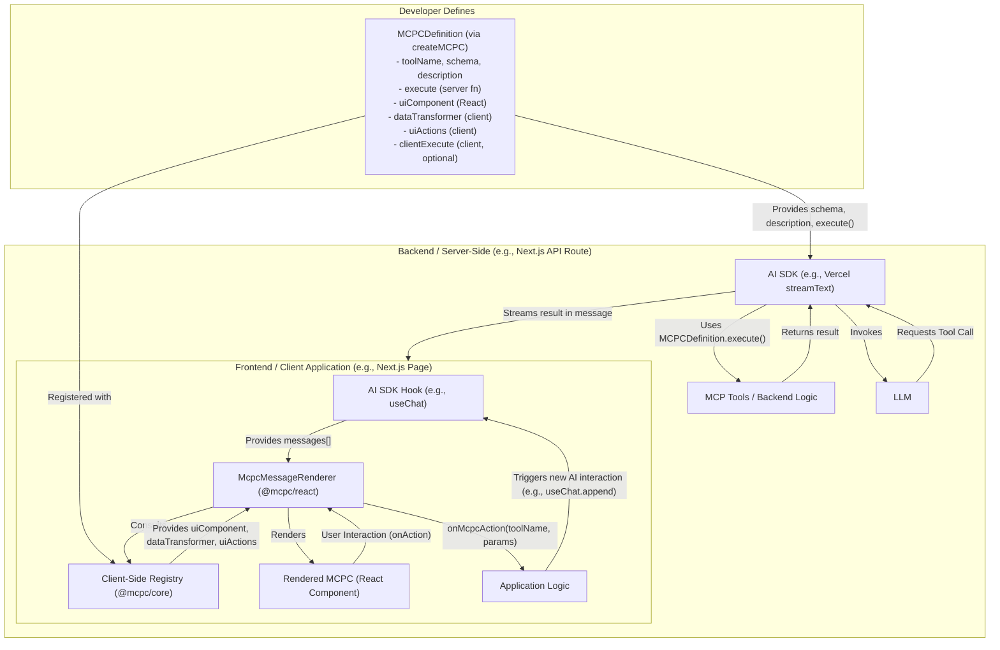

# mcpc - Model Context Protocol + Components

## Vision

AI responses are often trapped as text or raw JSON. **mcpc** frees them.

`mcpc` is an innovative full-stack protocol designed to bridge the gap between backend AI logic and rich, interactive frontend experiences. It provides a standardized way for AI models to render and interact with dynamic UI components, transforming the human side of Human-AI interaction.

Instead of limiting AI to text, `mcpc` enables it to present information and actions through a familiar UI, seamlessly blending AI capabilities with human-centric design. We envision an ecosystem where developers can easily create, share, and consume "AI-aware" UI components (MCPCs), making AI applications more intuitive, stateful, and powerful.

## Core Concepts

At its heart, `mcpc` defines a protocol for creating full-stack, AI-interactive UI components through **MCPC Definitions**. This allows for a clear separation of concerns while enabling truly stateful, interactive AI experiences.



1.  **MCPC Definition (`@mcpc/core`)**: 
    *   The central artifact created using a factory function like `createMCPC({...})`.
    *   It bundles all aspects of an AI-interactive component:
        *   `toolName`: A unique identifier (e.g., `weather.getCurrentWeather`).
        *   `description`: For the LLM to understand the tool's purpose.
        *   `schema`: Zod schema for the tool's input parameters.
        *   `execute`: **Server-side** function to be executed when the LLM calls the tool.
        *   `uiComponent`: The **React component** used to render the tool's result or other data.
        *   `dataTransformer` (optional): **Client-side** function to transform raw tool execution results into props suitable for the `uiComponent`.
        *   `uiActions` (optional): Defines how user interactions within the component translate into new actions. This can trigger new LLM tool calls or execute client-side logic for purely frontend interactions (e.g., optimistic updates).
        *   `clientExecute` (optional): Client-side functions that can be triggered by `uiActions` for purely frontend interactions without an LLM roundtrip.
    *   These definitions are designed to be isomorphic and can be imported in both server and client code.

2.  **Client-Side Registry (`@mcpc/core`)**: 
    *   A simple map where `MCPCDefinition` objects are registered on the client via `registerMcpcDefinition()`.
    *   The `McpcMessageRenderer` uses this registry to find the appropriate UI rendering logic for a given tool name.

3.  **`McpcMessageRenderer` (`@mcpc/react`)**: 
    *   A React component that renders messages from an AI SDK (like Vercel AI SDK's `useChat`).
    *   It inspects each message. If a message contains a tool call result, it looks up the corresponding `MCPCDefinition` in the registry.
    *   It then uses the `uiComponent`, `dataTransformer`, and `uiActions` from the definition to render the interactive UI.

4.  **AI SDK Integration**: 
    *   `mcpc` is designed to enhance the presentation layer of popular AI SDKs without altering their core message flow or state management.
    *   **Backend**: `MCPCDefinition`s provide the `tools` object for the AI SDK's core functions (e.g., `streamText`).
    *   **Frontend**: The AI SDK's hooks (e.g., `useChat`) provide the `messages` that are passed to the `McpcMessageRenderer`.

## The Vision: Stateful, Composable, Multi-Target Components

While the core implementation today is focused on React, the `mcpc` protocol is designed for a much broader future.

*   **Stateful Components**: The ultimate goal is for MCPCs to manage their own state, syncing between frontend and backend as needed. Imagine a component that can be optimistically updated on the client while the backend state is eventually consistent.
*   **AI-Driven Composition**: An AI shouldn't just call one component. It should be able to compose them. The protocol aims to support an `AI Bridge` that can intelligently chain components together to fulfill complex requests (e.g., find the weather, then book a flight if it's sunny).
*   **Multi-Target Rendering**: An MCPC definition could include renderers for different targets, allowing an AI to display a component in **React**, plain **HTML**, or even a **Terminal UI**, depending on the context.

## Getting Started (Conceptual - `createMCPC` focused)

(The code examples for defining, registering, and rendering an MCPC remain the same as they represent the current, concrete implementation.)

### 1. Define an MCPC (e.g., `weather-mcpc.ts`)

```typescript
// common/mcpc-definitions/weather-mcpc.ts
import { createMCPC, MCPCProps } from '@mcpc/core';
import { z } from 'zod';

export interface WeatherData { location: string; temperature: string; description: string; iconUrl?: string; }
export interface WeatherActionParams { location: string; days?: number; }

const WeatherDisplayComponent: React.FC<MCPCProps<WeatherData, WeatherActionParams>> = ({ data, onAction }) => {
  return (
    <div className="weather-card" style={{border: '1px solid #ccc', padding: '10px', margin: '5px'}}>
      <h4>{data.location}</h4>
      <p>Temperature: {data.temperature}</p>
      <p>Condition: {data.description} {data.iconUrl && }</p>
      <button onClick={() => onAction('GET_7_DAY_FORECAST', { location: data.location, days: 7 })}> 
        7-Day Forecast
      </button>
      <button onClick={() => onAction('REFRESH_CURRENT', { location: data.location })}>
        Refresh Current
      </button>
    </div>
  );
};

export const GetCurrentWeatherMCPC = createMCPC<z.ZodObject<{location: z.ZodString}>, 
  { city: string; temp_c: number; condition: string; icon: string }, 
  WeatherData, 
  WeatherActionParams 
>({
  toolName: 'weather.getCurrentWeather',
  description: 'Gets the current weather for a specified location.',
  schema: z.object({ location: z.string().describe("The city, e.g., San Francisco, CA") }),
  
  execute: async ({ location }) => {
    console.log(`SERVER: Fetching weather for ${location}`);
    await new Promise(res => setTimeout(res, 500)); 
    if (location.toLowerCase().includes("fail")) throw new Error ("Failed to fetch weather for this city");
    return {
      city: location,
      temp_c: Math.floor(Math.random() * 20) + 10, 
      condition: ['Sunny', 'Cloudy', 'Rainy', 'Partly Cloudy'][Math.floor(Math.random() * 4)],
      icon: 'mock_icon_url.png' 
    };
  },

  uiComponent: WeatherDisplayComponent,

  dataTransformer: (toolResult) => {
    return {
      location: toolResult.city,
      temperature: `${toolResult.temp_c}°C`,
      description: toolResult.condition,
      iconUrl: toolResult.icon
    };
  },

  uiActions: {
    'GET_7_DAY_FORECAST': {
      mcpToolName: 'weather.getSevenDayForecast', 
      mapParams: (params) => ({ city: params.location, num_days: params.days || 7 }),
    },
    'REFRESH_CURRENT': {
        mcpToolName: 'weather.getCurrentWeather', 
        mapParams: (params) => ({ location: params.location }),
    }
  },
});
```

### 2. Server-Side Setup (e.g., `pages/api/chat.ts`)

```typescript
// pages/api/chat.ts
import { openai } from '@ai-sdk/openai';
import { streamText } from 'ai';
import { GetCurrentWeatherMCPC } from '@/common/mcpc-definitions/weather-mcpc'; 

export const runtime = 'edge';

const serverTools:any = {
  [GetCurrentWeatherMCPC.toolName]: {
    description: GetCurrentWeatherMCPC.description,
    parameters: GetCurrentWeatherMCPC.schema,
    execute: GetCurrentWeatherMCPC.execute,
  },
};

export async function POST(req: Request) {
  const { messages } = await req.json();

  const result = await streamText({
    model: openai('gpt-4-turbo'), 
    messages,
    tools: serverTools,
  });

  return result.toAIStreamResponse();
}
```

### 3. Client-Side Registration & Rendering (e.g., `app/page.tsx`)

```typescript
// app/mcpc-client-setup.ts 
import { registerMcpcDefinition } from '@mcpc/core';
import { GetCurrentWeatherMCPC } from '@/common/mcpc-definitions/weather-mcpc'; 

registerMcpcDefinition(GetCurrentWeatherMCPC);
```

```tsx
// app/page.tsx
'use client';
import React from 'react';
import { useChat, Message } from 'ai/react';
import { McpcMessageRenderer } from '@mcpc/react';
import '@/app/mcpc-client-setup'; 

export default function ChatPage() {
  const { messages, input, handleInputChange, handleSubmit, append } = useChat({
    api: '/api/chat',
  });

  const handleMcpcAction = async (actionDetails: { toolToCall: string; params: any }) => {
    console.log('MCPC Action to handle by app:', actionDetails);
    append({
      role: 'user',
      content: `User action: Please execute tool '${actionDetails.toolToCall}' with parameters ${JSON.stringify(actionDetails.params)}. `,
    });
  };

  return (
    <div style={{ fontFamily: 'sans-serif', padding: '20px' }}>
      <h1>mcpc Demo Chat</h1>
      <div className="messages-container" style={{ maxHeight: '60vh', overflowY: 'auto', border: '1px solid #ddd', padding: '10px', marginBottom: '10px'}}>
        {messages.map((msg: Message) => (
          <div key={msg.id} style={{ marginBottom: '8px', padding: '5px', borderRadius: '4px', background: msg.role === 'user' ? '#e1f5fe' : '#f1f8e9' }}>
            <strong>{msg.role === 'user' ? 'You' : 'AI'}:</strong>
            { (msg.role === 'assistant' && typeof msg.content === 'string') && <p style={{margin:0}}>{msg.content}</p> }
            
            { (msg.role === 'assistant' && msg.tool_calls) && 
              msg.tool_calls.map((toolCall: any) => (
                <div key={toolCall.id}>
                  <p style={{margin:0, fontStyle:'italic'}}>Assistant wants to call: {toolCall.name}({JSON.stringify(toolCall.arguments)})</p>
                </div>
            ))}

            { msg.role === 'tool' && (
              <McpcMessageRenderer message={msg} onMcpcAction={handleMcpcAction} />
            )}

          </div>
        ))}
      </div>
      <form onSubmit={handleSubmit} style={{display:'flex'}}>
        <input
          value={input}
          onChange={handleInputChange}
          placeholder="Ask something or try 'weather in London'..."
          style={{flexGrow:1, padding:'8px', marginRight:'8px'}}
        />
        <button type="submit">Send</button>
      </form>
    </div>
  );
}
``

## Roadmap & Future Work

### Phase 1 (Core Framework)

*   **Define Core Types (`@mcpc/core`)**: Solidify `MCPCDefinition`, `MCPCRenderProps`, etc.
*   **Implement `createMCPC` Factory (`@mcpc/core`)**: The core developer experience for creating components.
*   **Implement Client-Side Registry (`@mcpc/core`)**: `registerMcpcDefinition` and `getMcpcDefinition`.
*   **Develop `McpcMessageRenderer` (`@mcpc/react`)**: The core React component for rendering MCPCs.
*   **Example MCPCs (`@mcpc/ui`)**: Build a library of basic, reusable components.
*   **Vercel AI SDK Example**: A full end-to-end Next.js reference implementation.

### Phase 2 & Beyond (The Protocol Vision)

*   **Advanced State Management**: Introduce explicit state management into the `MCPCDefinition`, including strategies for frontend/backend synchronization (e.g., optimistic, pessimistic).
*   **Multi-Target Rendering**: Extend the definition to allow components to specify renderers for React, HTML, and Terminal UIs.
*   **AI Composition Bridge**: Develop a higher-level `MCPCAIBridge` that allows the AI to intelligently compose multiple components into a single, coherent response.
*   **CLI & Ecosystem**: Build `npx mcpc ...` for discovering, sharing, and managing MCPC packages from a community registry.
*   **Security & Sandboxing**: Ensure robust security practices for both server-side execution and client-side rendering.

This is a living document and will evolve. Let's get building!